# Data Flow Documentation

## Table of Contents
1. [System Overview](#system-overview)
2. [Complete Query Flow](#complete-query-flow)
3. [Agent Interactions & Data Sharing](#agent-interactions--data-sharing)
4. [RAG (Retrieval-Augmented Generation) Flow](#rag-retrieval-augmented-generation-flow)
5. [Vector Database Operations](#vector-database-operations)
6. [Schema Extraction & Embedding Process](#schema-extraction--embedding-process)
7. [Caching Strategy](#caching-strategy)
8. [Detailed Component Interactions](#detailed-component-interactions)

---


## System Overview

The system is a multi-agent Natural Language to SQL pipeline that uses RAG (Retrieval-Augmented Generation) to retrieve relevant database schema information for accurate SQL generation.

### Architecture Diagram

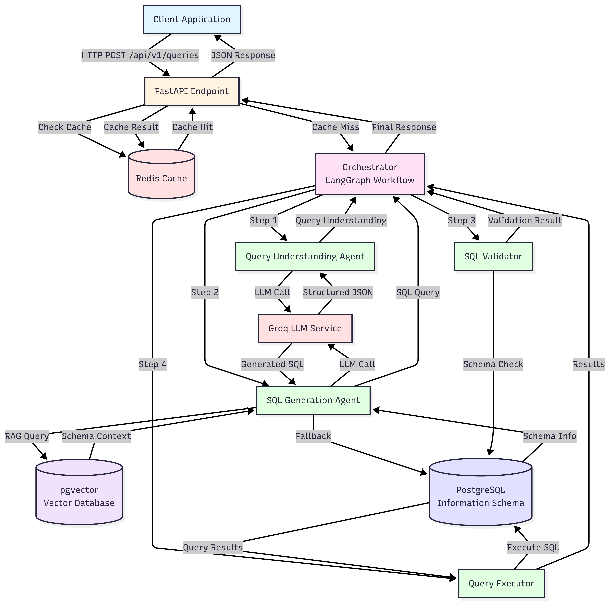

---

## Complete Query Flow

### High-Level Flow Diagram

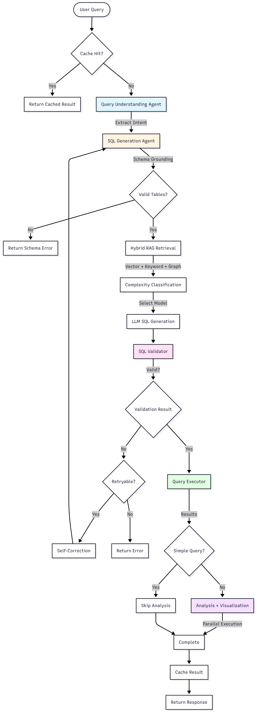

---

## Agent Interactions & Data Sharing

### Agent State Flow

The orchestrator uses a shared `AgentState` dictionary that flows through all agents:

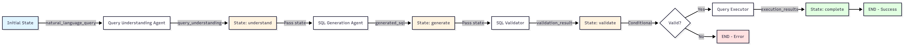

### AgentState Structure

```python
AgentState = {
    "natural_language_query": str,        # Original user query
    "query_understanding": dict,           # From Query Understanding Agent
    "generated_sql": str,                  # From SQL Generation Agent
    "validation_result": tuple,             # (is_valid, error) from Validator
    "execution_results": list,             # From Query Executor
    "error": str,                          # Error message if any
    "step": Literal["understand", "generate", "validate", "execute", "complete", "error"]
}
```

### Data Sharing Details

#### 1. Query Understanding → SQL Generation

**Data Passed:**
- `query_understanding` dict containing:
  - `intent`: Description of user intent
  - `tables`: List of required table names
  - `columns`: List of required column names
  - `filters`: List of filter conditions with operators
  - `aggregations`: List of aggregation functions (COUNT, SUM, etc.)
  - `group_by`: Columns for GROUP BY clause
  - `order_by`: Ordering specification
  - `limit`: Row limit if specified
  - `ambiguities`: List of unclear aspects
  - `needs_clarification`: Boolean flag

**Usage in SQL Generation:**
- Tables/columns used to build RAG search query
- Filters converted to WHERE clauses
- Aggregations converted to SELECT aggregations
- Group by/order by directly used in SQL

#### 2. SQL Generation → SQL Validator

**Data Passed:**
- `generated_sql`: Complete SQL query string

**Usage in Validation:**
- Syntax parsing using sqlparse
- Safety checks (dangerous keywords)
- Schema validation (table/column existence)

#### 3. SQL Validator → Query Executor

**Data Passed:**
- `validation_result`: Tuple of (is_valid: bool, error: str)
- `generated_sql`: SQL query (only if valid)

**Conditional Flow:**
- If `is_valid == True`: Proceed to execution
- If `is_valid == False`: Stop workflow, return error

#### 4. Query Executor → Final Response

**Data Passed:**
- `execution_results`: List of dictionaries (JSON-serializable)

**Post-processing:**
- Serialization of datetime, Decimal types
- Row limit enforcement
- Timeout handling

---

## RAG (Retrieval-Augmented Generation) Flow

### RAG Process Diagram

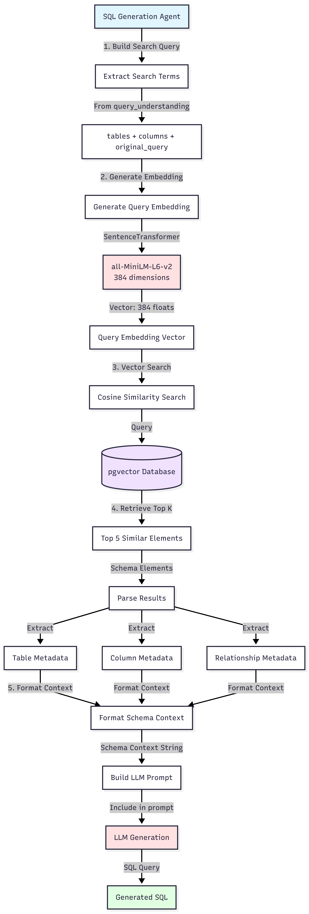

### RAG Implementation Details

#### Step 1: Building Search Query

```python
# Location: sql_generation.py, _retrieve_schema_context()

search_terms = []
search_terms.extend(query_understanding.get("tables", []))      # e.g., ["customers", "orders"]
search_terms.extend(query_understanding.get("columns", []))     # e.g., ["name", "total_amount"]
search_terms.append(natural_language_query)                     # Original query text

search_query = " ".join(search_terms)
# Example: "customers orders name total_amount Show me all customers"
```

#### Step 2: Embedding Generation

```python
# Location: pgvector_client.py, generate_embedding()

# Model: sentence-transformers/all-MiniLM-L6-v2
# Output: 384-dimensional vector
embedding = embedding_model.encode(search_query, convert_to_numpy=True)
# Returns: numpy array of shape (384,)
```

#### Step 3: Vector Similarity Search

```sql
-- Location: pgvector_client.py, search_similar()
-- Uses cosine distance (<=> operator in pgvector)

SELECT 
    id,
    document,
    metadata,
    1 - (embedding <=> $1::vector) as similarity
FROM vector_schema_embeddings
ORDER BY embedding <=> $1::vector
LIMIT 5;
```

**Index Used:**
- `ivfflat` index with `vector_cosine_ops` operator class
- Lists parameter: 100 (for ~1000-10000 vectors)

#### Step 4: Result Formatting

**RAG Results Structure:**
```python
[
    {
        "id": "table:customers",
        "document": "Table: customers\nColumns: id, name, email, city",
        "metadata": {
            "type": "table",
            "name": "customers",
            "columns": ["id", "name", "email", "city", "country"]
        },
        "distance": 0.15  # Lower = more similar
    },
    {
        "id": "column:customers.name",
        "document": "Column: customers.name (VARCHAR)",
        "metadata": {
            "type": "column",
            "table": "customers",
            "name": "name",
            "data_type": "VARCHAR"
        },
        "distance": 0.22
    },
    # ... more results
]
```

**Formatted Context:**
```
Table: customers
Columns: id, name, email, city, country
Column: customers.name (VARCHAR)
Column: customers.email (VARCHAR)
...
```

#### Step 5: Integration into LLM Prompt

The formatted schema context is included in the SQL generation prompt:

```python
# Location: sql_generation.py, generate_sql()

prompt = format_sql_generation_prompt(
    query_understanding=query_understanding,
    schema_context=schema_context,  # From RAG
    few_shot_examples=SQL_GENERATION_FEW_SHOT_EXAMPLES
)
```

---

## Vector Database Operations

### Vector Database Schema

```sql
CREATE TABLE vector_schema_embeddings (
    id TEXT PRIMARY KEY,                    -- e.g., "table:customers", "column:customers.name"
    embedding vector(384),                  -- 384-dimensional embedding vector
    document TEXT NOT NULL,                  -- Text representation for search
    metadata JSONB,                          -- Structured metadata
    created_at TIMESTAMP DEFAULT CURRENT_TIMESTAMP
);

-- Index for similarity search
CREATE INDEX vector_schema_embeddings_embedding_idx 
ON vector_schema_embeddings 
USING ivfflat (embedding vector_cosine_ops)
WITH (lists = 100);
```

### Vector Operations Flow

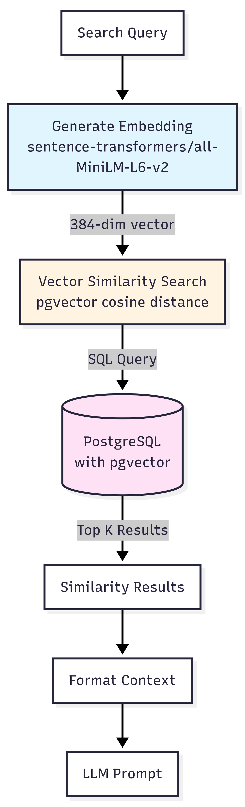

### Embedding Model Details

**Model:** `sentence-transformers/all-MiniLM-L6-v2`
- **Dimensions:** 384
- **Type:** Sentence Transformer (BERT-based)
- **Use Case:** Semantic similarity search
- **Performance:** Fast inference, good for schema matching

### Vector Storage Format

**In PostgreSQL (pgvector):**
```python
# Embedding is stored as pgvector type
embedding_str = '[' + ','.join(map(str, embedding)) + ']'
# Example: '[0.123, -0.456, 0.789, ...]' (384 values)

INSERT INTO vector_schema_embeddings (id, embedding, document, metadata)
VALUES ($1, $2::vector, $3, $4);
```

### Similarity Search Algorithm

**Distance Metric:** Cosine Distance
- Formula: `1 - (embedding1 <=> embedding2)`
- Range: 0 (identical) to 2 (opposite)
- Lower distance = higher similarity

**Search Query:**
```sql
SELECT 
    id,
    document,
    metadata,
    1 - (embedding <=> $1::vector) as similarity
FROM vector_schema_embeddings
ORDER BY embedding <=> $1::vector  -- Ascending = most similar first
LIMIT 5;
```

---

## Schema Extraction & Embedding Process

### Initial Schema Introspection Flow

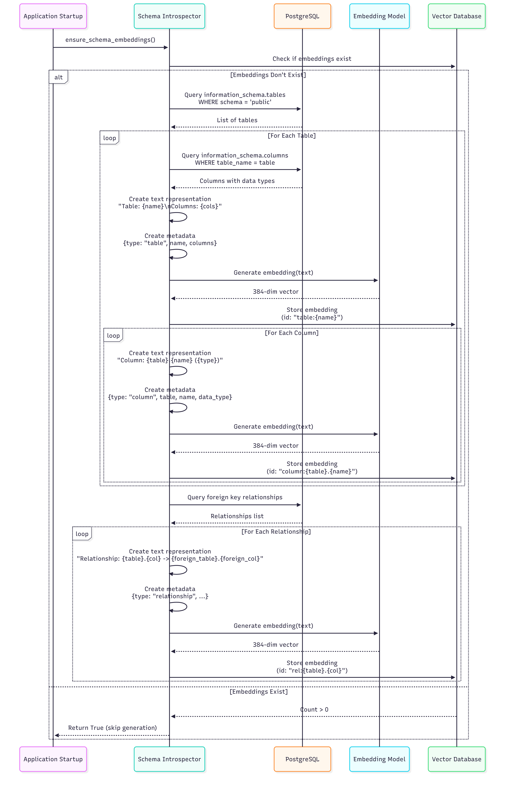

### Schema Element Types

#### 1. Table Embeddings

**Text Representation:**
```
Table: customers
Columns: id, name, email, created_at, city, country, phone
```

**Metadata:**
```json
{
    "type": "table",
    "name": "customers",
    "columns": ["id", "name", "email", "created_at", "city", "country", "phone"]
}
```

**ID:** `table:customers`

#### 2. Column Embeddings

**Text Representation:**
```
Column: customers.name (VARCHAR)
```

**Metadata:**
```json
{
    "type": "column",
    "table": "customers",
    "name": "name",
    "data_type": "VARCHAR",
    "is_nullable": "YES"
}
```

**ID:** `column:customers.name`

#### 3. Relationship Embeddings

**Text Representation:**
```
Relationship: orders.customer_id -> customers.id
```

**Metadata:**
```json
{
    "type": "relationship",
    "table": "orders",
    "column": "customer_id",
    "foreign_table": "customers",
    "foreign_column": "id"
}
```

**ID:** `rel:orders.customer_id`

### Dynamic Schema Fallback

If RAG doesn't return sufficient context, the system falls back to dynamic schema introspection:

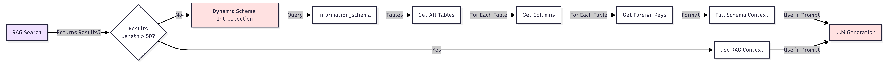

**Dynamic Schema Query:**
```sql
-- Get all tables
SELECT table_name
FROM information_schema.tables
WHERE table_schema = 'public'
AND table_type = 'BASE TABLE';

-- Get columns for each table
SELECT column_name, data_type
FROM information_schema.columns
WHERE table_schema = 'public'
AND table_name = :table_name;

-- Get relationships
SELECT
    tc.table_name,
    kcu.column_name,
    ccu.table_name AS foreign_table_name,
    ccu.column_name AS foreign_column_name
FROM information_schema.table_constraints AS tc
JOIN information_schema.key_column_usage AS kcu
    ON tc.constraint_name = kcu.constraint_name
JOIN information_schema.constraint_column_usage AS ccu
    ON ccu.constraint_name = tc.constraint_name
WHERE tc.constraint_type = 'FOREIGN KEY'
AND tc.table_schema = 'public';
```

---

## Caching Strategy

### Cache Flow Diagram

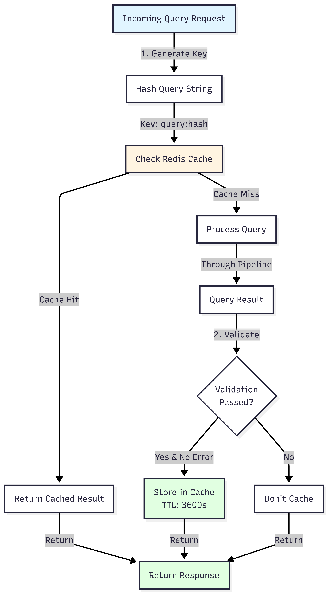

### Cache Implementation Details

**Cache Key Generation:**
```python
# Location: queries.py, submit_query()
cache_key = f"query:{hash(request.query)}"
# Example: "query:1234567890"
```

**Cache Check:**
```python
cached_result = await cache_service.get(cache_key)
if cached_result:
    return QueryResponse(**cached_result)
```

**Cache Storage:**
```python
# Only cache successful queries
if result.get("validation_passed", False) and not result.get("error"):
    await cache_service.set(cache_key, response.dict(), ttl=3600)
```

**Cache TTL:** 3600 seconds (1 hour)

**What Gets Cached:**
- Complete `QueryResponse` object:
  - `query_id`
  - `natural_language_query`
  - `generated_sql`
  - `results`
  - `execution_time_ms`

**What Doesn't Get Cached:**
- Queries that fail validation
- Queries with errors
- Queries that timeout

---

## Detailed Component Interactions

### LLM Service Model Selection

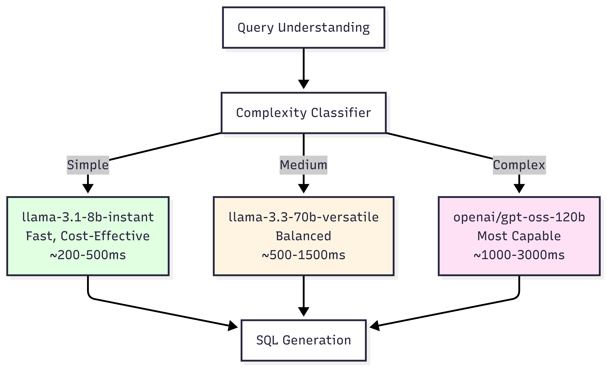

**Complexity Determination (SQL Generation):**
```python
# Location: sql_generation.py, _determine_complexity()

num_tables = len(query_understanding.get("tables", []))
has_aggregations = len(query_understanding.get("aggregations", [])) > 0
has_group_by = len(query_understanding.get("group_by", [])) > 0

if num_tables >= 3 or (has_aggregations and has_group_by and num_tables >= 2):
    return QueryComplexity.COMPLEX
elif num_tables >= 2 or has_aggregations:
    return QueryComplexity.MEDIUM
else:
    return QueryComplexity.SIMPLE
```

### SQL Validation Process

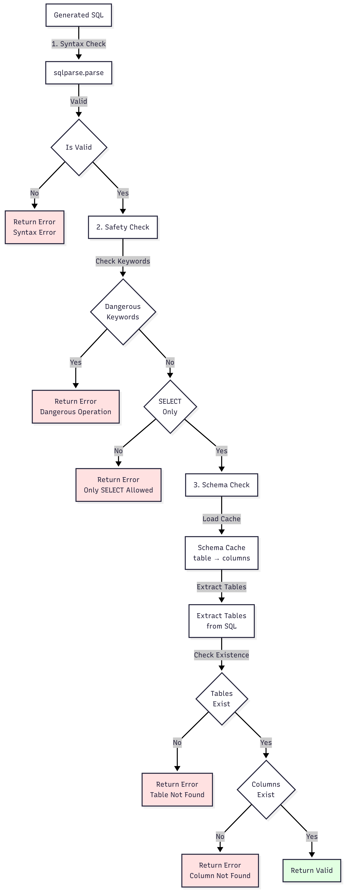

### Query Execution Safety Measures

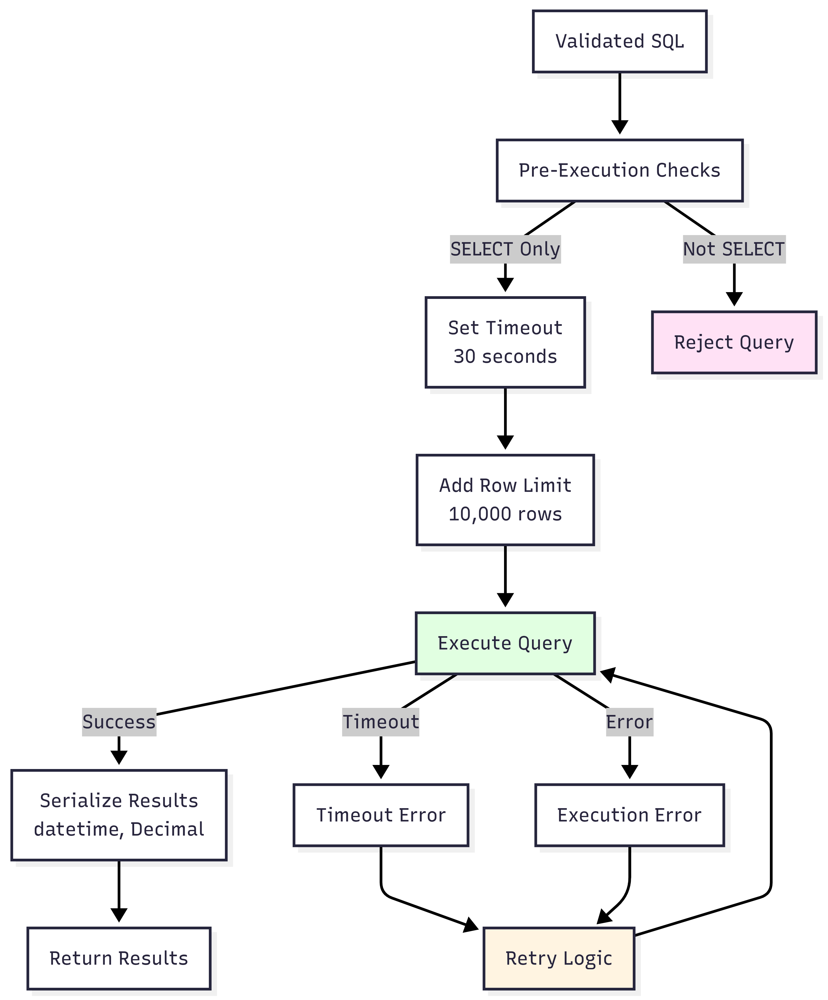

---

## Data Structures

### Query Understanding Output

```python
{
    "intent": "Retrieve all customers from New York",
    "tables": ["customers"],
    "columns": ["id", "name", "email", "city"],
    "filters": [
        {
            "column": "city",
            "operator": "=",
            "value": "New York",
            "type": "string"
        }
    ],
    "aggregations": [],
    "group_by": [],
    "order_by": None,
    "limit": None,
    "ambiguities": [],
    "needs_clarification": False
}
```

### SQL Generation Input

```python
{
    "query_understanding": {...},  # From Query Understanding Agent
    "natural_language_query": "Show me all customers from New York",
    "schema_context": """
        Table: customers
        Columns: id, name, email, city, country
        Column: customers.city (VARCHAR)
    """,
    "use_rag": True
}
```

### Validation Result

```python
(is_valid: bool, error_message: Optional[str])
# Example: (True, None)
# Example: (False, "Table 'users' does not exist")
```

### Query Response

```python
{
    "query_id": "uuid-string",
    "natural_language_query": "Show me all customers",
    "generated_sql": "SELECT id, name, email FROM customers LIMIT 100;",
    "results": [
        {"id": 1, "name": "John Doe", "email": "john@example.com"},
        {"id": 2, "name": "Jane Smith", "email": "jane@example.com"}
    ],
    "error": None,
    "execution_time_ms": 245.67
}
```

---

## Error Handling Flow

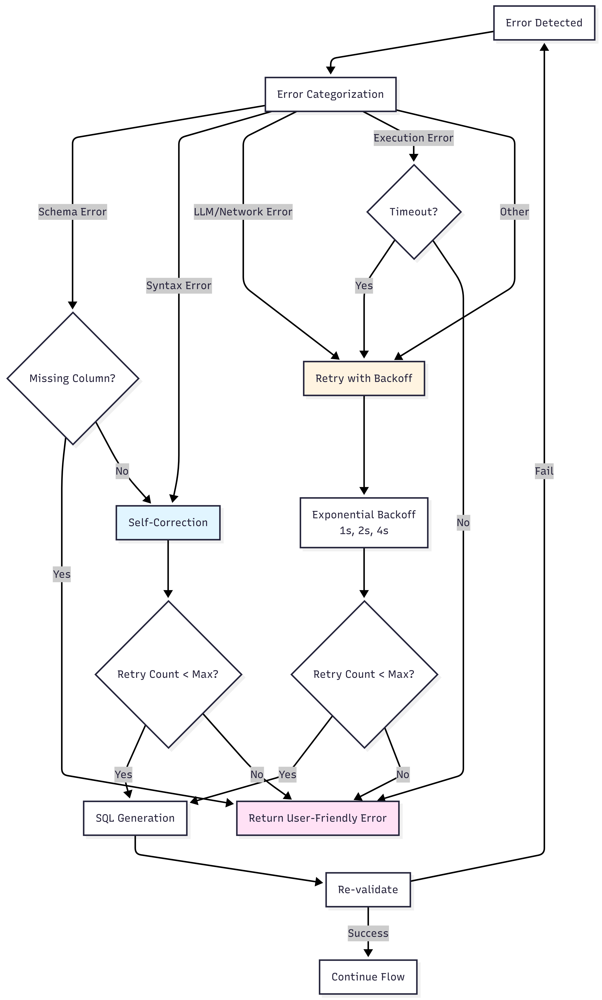

---

## Performance Considerations

### Caching Impact
- **Cache Hit:** ~5-10ms response time
- **Cache Miss:** ~500-2000ms (depending on query complexity)

### RAG Performance
- **Embedding Generation:** ~10-50ms per query
- **Vector Search:** ~5-20ms (with ivfflat index)
- **Total RAG Overhead:** ~15-70ms

### LLM Latency
- **Simple Model (8b):** ~200-500ms
- **Medium Model (70b):** ~500-1500ms
- **Complex Model (120b):** ~1000-3000ms

### Database Operations
- **Schema Introspection:** ~50-200ms (one-time at startup)
- **Query Execution:** Depends on query complexity (10ms - 30s timeout)

---

## Summary

This system implements a sophisticated multi-agent pipeline for converting natural language queries to SQL:

1. **Query Understanding Agent** extracts structured information from natural language
2. **SQL Generation Agent** uses RAG to retrieve relevant schema context and generates SQL
3. **SQL Validator** ensures safety and correctness
4. **Query Executor** runs the query with safety measures
5. **Vector Database** stores schema embeddings for semantic search
6. **Caching** improves performance for repeated queries

The entire flow is orchestrated by a LangGraph-based workflow that manages state and conditional routing between agents.

