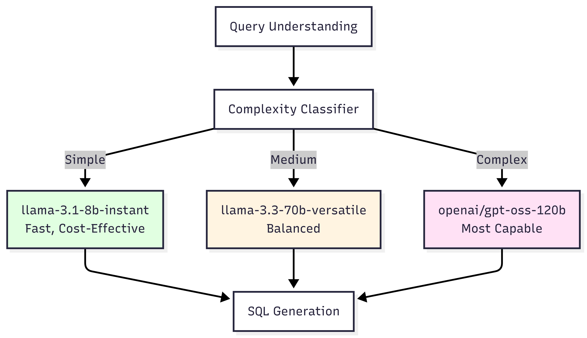
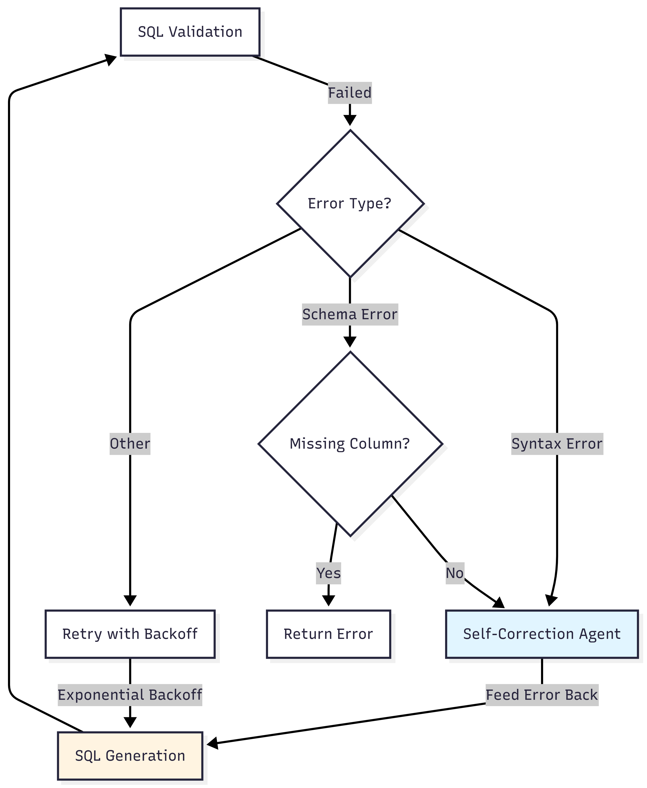
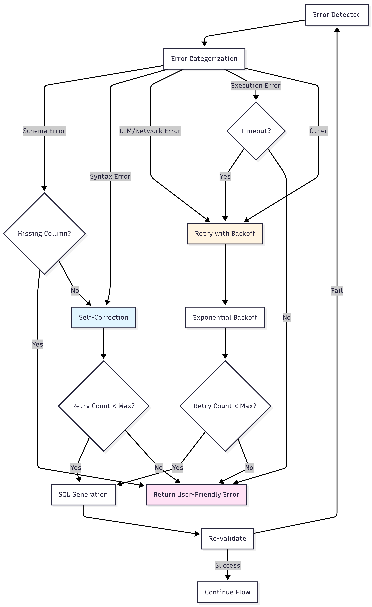

# Data Flow Documentation

## Table of Contents
1. [System Overview](#system-overview)
2. [Complete Query Flow](#complete-query-flow)
3. [Agent Interactions & Data Sharing](#agent-interactions--data-sharing)
4. [RAG (Retrieval-Augmented Generation) Flow](#rag-retrieval-augmented-generation-flow)
5. [Vector Database Operations](#vector-database-operations)
6. [Schema Extraction & Embedding Process](#schema-extraction--embedding-process)
7. [Caching Strategy](#caching-strategy)
8. [Detailed Component Interactions](#detailed-component-interactions)

---


## System Overview

The system is a multi-agent Natural Language to SQL pipeline that uses RAG (Retrieval-Augmented Generation) to retrieve relevant database schema information for accurate SQL generation.

### Architecture Diagram


---

## Complete Query Flow

### High-Level Flow Diagram


### Complete Multi-Agent Pipeline Flow

The system uses a LangGraph-based orchestrator that coordinates multiple specialized agents:


### Flow Steps

1. **Cache Check**: First checks Redis cache for identical queries
2. **Query Understanding**: Extracts intent, tables, columns, filters, aggregations
3. **Schema Grounding**: Validates tables/columns against actual database schema
4. **Hybrid RAG**: Retrieves relevant schema context using vector + keyword + graph search
5. **Complexity Classification**: Determines query complexity (SIMPLE/MEDIUM/COMPLEX)
6. **Model Selection**: Routes to appropriate LLM model based on complexity
7. **SQL Generation**: Generates SQL with schema context and few-shot examples
8. **SQL Validation**: Validates syntax, safety, and schema correctness
9. **Self-Correction**: Attempts to fix errors by feeding back to SQL generation
10. **Query Execution**: Executes SQL with timeout and row limits
11. **Analysis & Visualization**: Generates insights and chart configs (parallel, skipped for simple queries)
12. **Caching**: Caches successful results for 1 hour

---

## Agent Interactions & Data Sharing

### Agent State Flow

The orchestrator uses a shared `AgentState` dictionary that flows through all agents:


### AgentState Structure

```python
AgentState = {
    "natural_language_query": str,        # Original user query
    "query_understanding": dict,           # From Query Understanding Agent
    "generated_sql": str,                  # From SQL Generation Agent
    "validation_result": tuple,             # (is_valid, error) from Validator
    "execution_results": list,             # From Query Executor
    "execution_time_ms": Optional[float],  # Query execution time
    "analysis": Optional[dict],            # From Analysis Agent
    "visualization": Optional[dict],       # From Visualization Agent
    "error": str,                          # Error message if any
    "error_category": Optional[str],       # Error category for retry logic
    "retry_count": int,                    # Current retry attempt
    "max_retries": int,                    # Maximum retry attempts
    "step": Literal[
        "understand", "generate", "validate", "execute", 
        "retry", "self_correct", "analyze", "visualize", 
        "analyze_and_visualize", "complete", "error"
    ]
}
```

### Agent State Flow Diagram


### Data Sharing Details

#### 1. Query Understanding → SQL Generation

**Data Passed:**
- `query_understanding` dict containing:
  - `intent`: Description of user intent
  - `tables`: List of required table names
  - `columns`: List of required column names
  - `filters`: List of filter conditions with operators
  - `aggregations`: List of aggregation functions (COUNT, SUM, etc.)
  - `group_by`: Columns for GROUP BY clause
  - `order_by`: Ordering specification
  - `limit`: Row limit if specified
  - `ambiguities`: List of unclear aspects
  - `needs_clarification`: Boolean flag

**Usage in SQL Generation:**
- Tables/columns used to build RAG search query
- Filters converted to WHERE clauses
- Aggregations converted to SELECT aggregations
- Group by/order by directly used in SQL

#### 2. SQL Generation → SQL Validator

**Data Passed:**
- `generated_sql`: Complete SQL query string

**Usage in Validation:**
- Syntax parsing using sqlparse
- Safety checks (dangerous keywords)
- Schema validation (table/column existence)

#### 3. SQL Validator → Query Executor

**Data Passed:**
- `validation_result`: Tuple of (is_valid: bool, error: str)
- `generated_sql`: SQL query (only if valid)

**Conditional Flow:**
- If `is_valid == True`: Proceed to execution
- If `is_valid == False`: Stop workflow, return error

#### 4. Query Executor → Analysis/Visualization or Complete

**Data Passed:**
- `execution_results`: List of dictionaries (JSON-serializable)
- `execution_time_ms`: Query execution time

**Conditional Flow:**
- If simple query (single table, no aggregations, < 10 rows): Skip to complete
- If complex query: Proceed to analysis and visualization

**Post-processing:**
- Serialization of datetime, Decimal types
- Row limit enforcement
- Timeout handling

#### 5. Analysis Agent → Visualization Agent

**Data Passed:**
- `query_understanding`: Original understanding
- `generated_sql`: SQL that was executed
- `results`: Query execution results
- `execution_time_ms`: Execution time

**Analysis Output:**
- `insights`: List of key insights
- `trends`: Identified trends
- `anomalies`: Detected anomalies
- `recommendations`: Actionable recommendations
- `summary`: Executive summary

#### 6. Visualization Agent → Final Response

**Data Passed:**
- `query_understanding`: Original understanding
- `results`: Query execution results
- `analysis`: Analysis output (optional)

**Visualization Output:**
- `chart_type`: Type of chart (bar, line, pie, etc.)
- `recharts_component`: React component name
- `data_config`: Chart data configuration
- `title`: Chart title
- `description`: Chart description

**Note:** Analysis and Visualization run in parallel for better performance.

---

## RAG (Retrieval-Augmented Generation) Flow

### RAG Process Diagram


### Hybrid RAG Architecture

The system uses a **Hybrid RAG** approach that combines three retrieval methods:


### RAG Implementation Details

#### Step 1: Dynamic Schema Grounding (First Priority)

Before RAG, the system **always** validates against the actual database schema:

```python
# Location: sql_generation.py, _get_dynamic_schema_info()

# Get actual schema from database
actual_schema = await self._get_dynamic_schema_info()

# Ground query understanding (remove non-existent columns/tables)
grounded_understanding = await self._ground_query_understanding(
    query_understanding,
    actual_schema
)
```

**Purpose:** Ensures only valid tables/columns are used, preventing hallucination.

#### Step 2: Hybrid RAG Retrieval (Parallel Execution)

The system runs three retrieval methods in parallel:

```python
# Location: hybrid_rag.py, search()

# Run all searches in parallel
vector_task = self._vector_search(query, n_results)
keyword_task = self._keyword_search(tables, columns, n_results)
graph_task = self._graph_based_retrieval(tables, n_results)

# Execute in parallel
vector_results, keyword_results, graph_results = await asyncio.gather(
    vector_task, keyword_task, graph_task, return_exceptions=True
)
```

**1. Vector Search (Semantic Similarity)**
- Uses pgvector with cosine distance
- Model: `sentence-transformers/all-MiniLM-L6-v2` (384 dimensions)
- Finds semantically similar schema elements

```python
# Location: hybrid_rag.py, _vector_search()

results = await self.vector_store.search_similar(query, n_results=n_results)
```

**2. Keyword Search (Exact Matching)**
- BM25-like exact matching for table/column names
- Searches keyword index built from schema metadata
- Finds exact matches for tables and columns mentioned in query

```python
# Location: hybrid_rag.py, _keyword_search()

# Search for exact table/column names
for table in tables:
    if table.lower() in self._keyword_index:
        results.append(self._keyword_index[table.lower()])
```

**3. Graph-Based Search (Relationship Discovery)**
- Uses foreign key relationships to find related tables
- Traverses schema graph to discover connections
- Finds tables connected via foreign keys

```python
# Location: hybrid_rag.py, _graph_based_retrieval()

# Find tables connected via foreign keys
for table in tables:
    connected = self._schema_graph.get(table, set())
    for connected_table in connected:
        results.append(get_table_info(connected_table))
```

#### Step 3: Result Combination & Deduplication

```python
# Location: hybrid_rag.py, _combine_results()

# Combine results from all three methods
combined_results = self._combine_results(
    vector_results,
    keyword_results,
    graph_results,
    n_results
)
```

**Deduplication Strategy:**
- Removes duplicate entries by ID
- Prioritizes keyword matches (most precise)
- Then graph results (relationship context)
- Finally vector results (semantic similarity)

#### Step 4: Context Formatting

**RAG Results Structure:**
```python
[
    {
        "id": "table:customers",
        "document": "Table: customers\nColumns: id, name, email, city",
        "metadata": {
            "type": "table",
            "name": "customers",
            "columns": ["id", "name", "email", "city", "country"]
        },
        "distance": 0.15,  # From vector search
        "source": "vector"  # or "keyword" or "graph"
    },
    # ... more results
]
```

**Formatted Context:**
```
Table: customers
Columns: id, name, email, city, country
Column: customers.name (VARCHAR)
Relationship: orders.customer_id -> customers.id
...
```

#### Step 5: Integration into LLM Prompt

The formatted schema context (grounded + RAG) is included in the SQL generation prompt:

```python
# Location: sql_generation.py, generate_sql()

# Start with actual schema (grounding)
schema_context = actual_schema

# Add RAG context if available
if rag_context:
    schema_context = f"{actual_schema}\n\nAdditional Context:\n{rag_context}"

prompt = format_sql_generation_prompt(
    query_understanding=grounded_understanding,
    schema_context=schema_context,
    few_shot_examples=SQL_GENERATION_FEW_SHOT_EXAMPLES
)
```

### RAG Performance

- **Vector Search:** ~5-20ms (with ivfflat index)
- **Keyword Search:** ~1-5ms (in-memory index)
- **Graph Search:** ~2-10ms (in-memory graph)
- **Parallel Execution:** Total ~5-20ms (not sequential)
- **Total RAG Overhead:** ~15-70ms including embedding generation

---

## Vector Database Operations

### Vector Database Schema

```sql
CREATE TABLE vector_schema_embeddings (
    id TEXT PRIMARY KEY,                    -- e.g., "table:customers", "column:customers.name"
    embedding vector(384),                  -- 384-dimensional embedding vector
    document TEXT NOT NULL,                  -- Text representation for search
    metadata JSONB,                          -- Structured metadata
    created_at TIMESTAMP DEFAULT CURRENT_TIMESTAMP
);

-- Index for similarity search
CREATE INDEX vector_schema_embeddings_embedding_idx 
ON vector_schema_embeddings 
USING ivfflat (embedding vector_cosine_ops)
WITH (lists = 100);
```

### Vector Operations Flow


### Embedding Model Details

**Model:** `sentence-transformers/all-MiniLM-L6-v2`
- **Dimensions:** 384
- **Type:** Sentence Transformer (BERT-based)
- **Use Case:** Semantic similarity search
- **Performance:** Fast inference, good for schema matching

### Vector Storage Format

**In PostgreSQL (pgvector):**
```python
# Embedding is stored as pgvector type
embedding_str = '[' + ','.join(map(str, embedding)) + ']'
# Example: '[0.123, -0.456, 0.789, ...]' (384 values)

INSERT INTO vector_schema_embeddings (id, embedding, document, metadata)
VALUES ($1, $2::vector, $3, $4);
```

### Similarity Search Algorithm

**Distance Metric:** Cosine Distance
- Formula: `1 - (embedding1 <=> embedding2)`
- Range: 0 (identical) to 2 (opposite)
- Lower distance = higher similarity

**Search Query:**
```sql
SELECT 
    id,
    document,
    metadata,
    1 - (embedding <=> $1::vector) as similarity
FROM vector_schema_embeddings
ORDER BY embedding <=> $1::vector  -- Ascending = most similar first
LIMIT 5;
```

---

## Schema Extraction & Embedding Process

### Initial Schema Introspection Flow


### Schema Element Types

#### 1. Table Embeddings

**Text Representation:**
```
Table: customers
Columns: id, name, email, created_at, city, country, phone
```

**Metadata:**
```json
{
    "type": "table",
    "name": "customers",
    "columns": ["id", "name", "email", "created_at", "city", "country", "phone"]
}
```

**ID:** `table:customers`

#### 2. Column Embeddings

**Text Representation:**
```
Column: customers.name (VARCHAR)
```

**Metadata:**
```json
{
    "type": "column",
    "table": "customers",
    "name": "name",
    "data_type": "VARCHAR",
    "is_nullable": "YES"
}
```

**ID:** `column:customers.name`

#### 3. Relationship Embeddings

**Text Representation:**
```
Relationship: orders.customer_id -> customers.id
```

**Metadata:**
```json
{
    "type": "relationship",
    "table": "orders",
    "column": "customer_id",
    "foreign_table": "customers",
    "foreign_column": "id"
}
```

**ID:** `rel:orders.customer_id`

### Dynamic Schema Grounding (Primary Method)

The system **always** uses dynamic schema introspection as the primary method, with RAG providing additional context:


**Key Change:** Dynamic schema is no longer a "fallback" - it's the **primary grounding method**. RAG provides supplementary context for relationships and examples.

**Dynamic Schema Query:**
```sql
-- Get all tables
SELECT table_name
FROM information_schema.tables
WHERE table_schema = 'public'
AND table_type = 'BASE TABLE';

-- Get columns for each table
SELECT column_name, data_type
FROM information_schema.columns
WHERE table_schema = 'public'
AND table_name = :table_name;

-- Get relationships
SELECT
    tc.table_name,
    kcu.column_name,
    ccu.table_name AS foreign_table_name,
    ccu.column_name AS foreign_column_name
FROM information_schema.table_constraints AS tc
JOIN information_schema.key_column_usage AS kcu
    ON tc.constraint_name = kcu.constraint_name
JOIN information_schema.constraint_column_usage AS ccu
    ON ccu.constraint_name = tc.constraint_name
WHERE tc.constraint_type = 'FOREIGN KEY'
AND tc.table_schema = 'public';
```

---

## Caching Strategy

### Cache Flow Diagram


### Cache Implementation Details

**Cache Key Generation:**
```python
# Location: queries.py, submit_query()
cache_key = f"query:{hash(request.query)}"
# Example: "query:1234567890"
```

**Cache Check:**
```python
cached_result = await cache_service.get(cache_key)
if cached_result:
    return QueryResponse(**cached_result)
```

**Cache Storage:**
```python
# Only cache successful queries
if result.get("validation_passed", False) and not result.get("error"):
    await cache_service.set(cache_key, response.dict(), ttl=3600)
```

**Cache TTL:** 3600 seconds (1 hour)

**What Gets Cached:**
- Complete `QueryResponse` object:
  - `query_id`
  - `natural_language_query`
  - `generated_sql`
  - `results`
  - `execution_time_ms`

**What Doesn't Get Cached:**
- Queries that fail validation
- Queries with errors
- Queries that timeout

---

## Detailed Component Interactions

### LLM Service Model Selection


**Complexity-Based Model Routing:**



**Complexity Classification:**

```python
# Location: complexity_classifier.py, classify_from_understanding()

num_tables = len(query_understanding.get("tables", []))
has_aggregations = len(query_understanding.get("aggregations", [])) > 0
has_group_by = len(query_understanding.get("group_by", [])) > 0
has_subqueries = "subquery" in query_understanding.get("intent", "").lower()

if num_tables >= 3 or (has_aggregations and has_group_by and num_tables >= 2) or has_subqueries:
    return QueryComplexity.COMPLEX
elif num_tables >= 2 or has_aggregations:
    return QueryComplexity.MEDIUM
else:
    return QueryComplexity.SIMPLE
```

**Model Selection:**
```python
# Location: llm_client.py, _select_model()

if complexity == QueryComplexity.SIMPLE:
    return "llama-3.1-8b-instant"  # Fast, ~200-500ms
elif complexity == QueryComplexity.MEDIUM:
    return "llama-3.3-70b-versatile"  # Balanced, ~500-1500ms
else:
    return "openai/gpt-oss-120b"  # Powerful, ~1000-3000ms
```

**Cost Optimization:**
- Simple queries use cheapest model (60%+ cost savings)
- Medium queries use balanced model
- Complex queries use most capable model

### SQL Validation Process


### Self-Correction Mechanism

When validation fails, the system attempts self-correction:


**Self-Correction Process:**
```python
# Location: orchestrator.py, _self_correct_node()

if error_category in [ErrorCategory.SYNTAX_ERROR, ErrorCategory.SCHEMA_ERROR]:
    corrected_sql = await self.sql_generation_agent.self_correct_sql(
        query_understanding=query_understanding,
        natural_language_query=natural_language_query,
        previous_sql=previous_sql,
        error_message=error_message
    )
```

**Retry Logic:**
- Maximum 3 retry attempts
- Exponential backoff: 1s, 2s, 4s
- Self-correction for syntax/schema errors
- Direct retry for LLM/network errors

### Query Execution Safety Measures


---

## Data Structures

### Query Understanding Output

```python
{
    "intent": "Retrieve all customers from New York",
    "tables": ["customers"],
    "columns": ["id", "name", "email", "city"],
    "filters": [
        {
            "column": "city",
            "operator": "=",
            "value": "New York",
            "type": "string"
        }
    ],
    "aggregations": [],
    "group_by": [],
    "order_by": None,
    "limit": None,
    "ambiguities": [],
    "needs_clarification": False
}
```

### SQL Generation Input

```python
{
    "query_understanding": {...},  # From Query Understanding Agent
    "natural_language_query": "Show me all customers from New York",
    "schema_context": """
        Table: customers
        Columns: id, name, email, city, country
        Column: customers.city (VARCHAR)
    """,
    "use_rag": True
}
```

### Validation Result

```python
(is_valid: bool, error_message: Optional[str])
# Example: (True, None)
# Example: (False, "Table 'users' does not exist")
```

### Query Response

```python
{
    "query_id": "uuid-string",
    "natural_language_query": "Show me all customers",
    "generated_sql": "SELECT id, name, email FROM customers LIMIT 100;",
    "results": [
        {"id": 1, "name": "John Doe", "email": "john@example.com"},
        {"id": 2, "name": "Jane Smith", "email": "jane@example.com"}
    ],
    "analysis": {
        "insights": ["Total customers: 2", "All customers have valid emails"],
        "trends": [],
        "anomalies": [],
        "recommendations": ["Consider adding more customer data"],
        "summary": "Query returned 2 customers with complete information"
    },
    "visualization": {
        "chart_type": "table",
        "recharts_component": "DataTable",
        "data_config": {...},
        "title": "Customer List",
        "description": "All customers in the database"
    },
    "error": None,
    "execution_time_ms": 245.67,
    "pagination": {
        "page": 1,
        "page_size": 100,
        "total_results": 2,
        "total_pages": 1,
        "has_next": False,
        "has_previous": False
    },
    "cost_breakdown": {
        "tokens": {"input": 150, "output": 50},
        "cost": 0.00015
    }
}
```

---

## Error Handling Flow


### Error Handling with Retry and Self-Correction



**Error Categories:**
- **SCHEMA_ERROR**: Missing tables/columns (non-retryable if column doesn't exist)
- **SYNTAX_ERROR**: SQL syntax issues (self-correctable)
- **LLM_ERROR**: LLM API failures (retryable)
- **NETWORK_ERROR**: Network timeouts (retryable)
- **EXECUTION_ERROR**: Query execution failures (retryable for timeouts)
- **TIMEOUT_ERROR**: Query timeout (retryable)

**Retry Strategy:**
- Maximum 3 retry attempts
- Exponential backoff: 1s, 2s, 4s
- Self-correction for syntax/schema errors (feeds error back to SQL generation)
- Direct retry for LLM/network/execution errors

---

## Performance Considerations

### Caching Impact
- **Cache Hit:** ~5-10ms response time
- **Cache Miss:** ~500-3000ms (depending on query complexity and model selection)

### Hybrid RAG Performance
- **Vector Search:** ~5-20ms (with ivfflat index, parallel execution)
- **Keyword Search:** ~1-5ms (in-memory index, parallel execution)
- **Graph Search:** ~2-10ms (in-memory graph, parallel execution)
- **Embedding Generation:** ~10-50ms per query
- **Total RAG Overhead:** ~15-70ms (parallel execution reduces total time)

### LLM Latency (Complexity-Based Routing)
- **Simple Model (8b):** ~200-500ms (60%+ cost savings)
- **Medium Model (70b):** ~500-1500ms
- **Complex Model (120b):** ~1000-3000ms
- **Model Selection Overhead:** <1ms (complexity classification)

### Database Operations
- **Dynamic Schema Grounding:** ~10-50ms (validates against actual schema)
- **Schema Introspection:** ~50-200ms (one-time at startup)
- **Query Execution:** Depends on query complexity (10ms - 30s timeout)

### Parallel Execution Benefits
- **Analysis + Visualization:** Run in parallel, saving ~500-1500ms
- **Hybrid RAG:** Three search methods run in parallel, saving ~10-30ms
- **Total Parallel Savings:** ~500-1500ms per complex query

### Overall Performance
- **Simple Query (Cached):** ~5-10ms
- **Simple Query (Uncached):** ~300-800ms
- **Medium Query (Uncached):** ~800-2000ms
- **Complex Query (Uncached):** ~2000-5000ms (with analysis/visualization)

---

## Summary

This system implements a sophisticated multi-agent pipeline for converting natural language queries to SQL with analysis and visualization:

1. **Query Understanding Agent** extracts structured information from natural language (intent, tables, columns, filters, aggregations)
2. **Dynamic Schema Grounding** validates and grounds query understanding against actual database schema (prevents hallucination)
3. **Hybrid RAG System** retrieves relevant schema context using:
   - Vector search (semantic similarity via pgvector)
   - Keyword search (exact matching for tables/columns)
   - Graph-based search (foreign key relationships)
4. **Complexity Classifier** determines query complexity (SIMPLE/MEDIUM/COMPLEX)
5. **Intelligent Model Routing** selects appropriate LLM model based on complexity:
   - Simple: `llama-3.1-8b-instant` (fast, cost-effective)
   - Medium: `llama-3.3-70b-versatile` (balanced)
   - Complex: `openai/gpt-oss-120b` (most capable)
6. **SQL Generation Agent** generates SQL with grounded schema context and few-shot examples
7. **SQL Validator** ensures safety, syntax correctness, and schema validation
8. **Self-Correction Mechanism** attempts to fix errors by feeding validation errors back to SQL generation
9. **Query Executor** runs the query with timeout and row limits
10. **Analysis Agent** generates insights, trends, anomalies, and recommendations (parallel execution)
11. **Visualization Agent** creates chart configurations for data visualization (parallel execution)
12. **Conditional Routing** skips analysis/visualization for simple queries (single table, no aggregations, < 10 rows)
13. **Caching** improves performance for repeated queries (1 hour TTL)
14. **Retry Logic** with exponential backoff for transient errors

The entire flow is orchestrated by a LangGraph-based workflow that manages state and conditional routing between agents, with support for retry, self-correction, and parallel execution of analysis and visualization.

---

## Mermaid Diagram Code for Image Generation

Below are the Mermaid diagram code blocks that correspond to the PNG images in the `assets/` directory. Use these to regenerate the images when the flow changes.

### High-Level Flow Diagram

**File:** `assets/high_level_flow_diagram.png`

### Agent State Flow Diagram

**File:** `assets/agent_state_flow.png`

### Hybrid RAG Process Diagram

**File:** `assets/rag_process_diagram.png`

### LLM Service Model Selection Diagram

**File:** `assets/llm_service_model_selection.png`

### Error Handling Flow Diagram

**File:** `assets/error_handling_flow.png`

### Dynamic Schema Fallback Diagram

**File:** `assets/dynamic_schema_fallback.png`

### SQL Validation Process Diagram

**File:** `assets/sql_validation_process.png`

### Query Execution Safety Measures Diagram

**File:** `assets/query_execution_safety_measures.png`

### Cache Flow Diagram

**File:** `assets/cache_flow_diagram.png`

### Vector Operations Flow Diagram

**File:** `assets/vector_operations_flow.png`

### Initial Schema Introspection Flow Diagram

**File:** `assets/initial_schema_introspection_flow.png`


